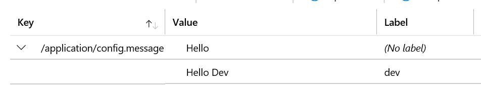

# spring-boot-azure-app-config
Simple Spring Boot Service using Azure App Config

This is a simple application that shows how to use spring profiles to access key/values across different environments tagged as labels in Azure App Config.

The code contains **bootstrap.yml**, **bootstrap-dev.yml** and **bootstrap-test.yml** which have different labels referring to the different environments. They all have the same connection strings, the differentiator being the labels.

Note: Modify the connection string in the property files to point to your own Azure App Configuration Store connection string.

Create 2 keys in your config store as below:

Run **mvnw package** to build the code.

**Default Profile**

Run **java -jar target\spring-boot-azure-app-config-0.0.1-SNAPSHOT.jar** to tell spring to pick the default profile

curl http://localhost:8080 should print "Hello"

**Dev Profile**

Run **java -Dspring.profiles.active=dev -jar target\spring-boot-azure-app-config-0.0.1-SNAPSHOT.jar** to tell spring to pick dev as the active profile.

curl http://localhost:8080 should print "Hello Dev"

**Test Profile**

Run **java -Dspring.profiles.active=test -jar target\spring-boot-azure-app-config-0.0.1-SNAPSHOT.jar** to tell spring to pick dev as the active profile.

curl http://localhost:8080 should print "Hello Test"
