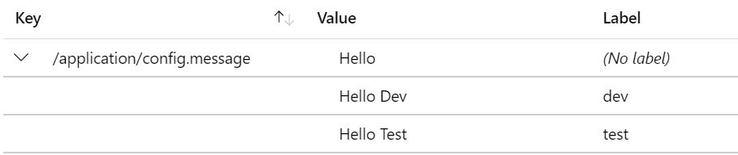

# spring-boot-azure-app-config
Simple Spring Boot Service using Azure App Config

The code containers **application.properties** and **application-dev.properties**.

Modify the connection string in the property files to point to your own Azure App Configuration Store connection string.

Create 2 keys in your config store as below:

Run **mvnw package** to build the code.

**Default Profile**

Run **java -jar target\spring-boot-azure-app-config-0.0.1-SNAPSHOT.jar** to tell spring to pick the default profile

**Dev Profile**

Run **java -Dspring.profiles.active=dev -jar target\spring-boot-azure-app-config-0.0.1-SNAPSHOT.jar** to tell spring to pick dev as the active profile.
